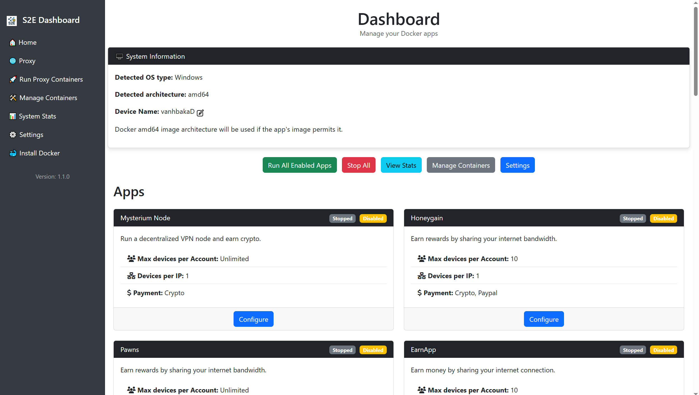
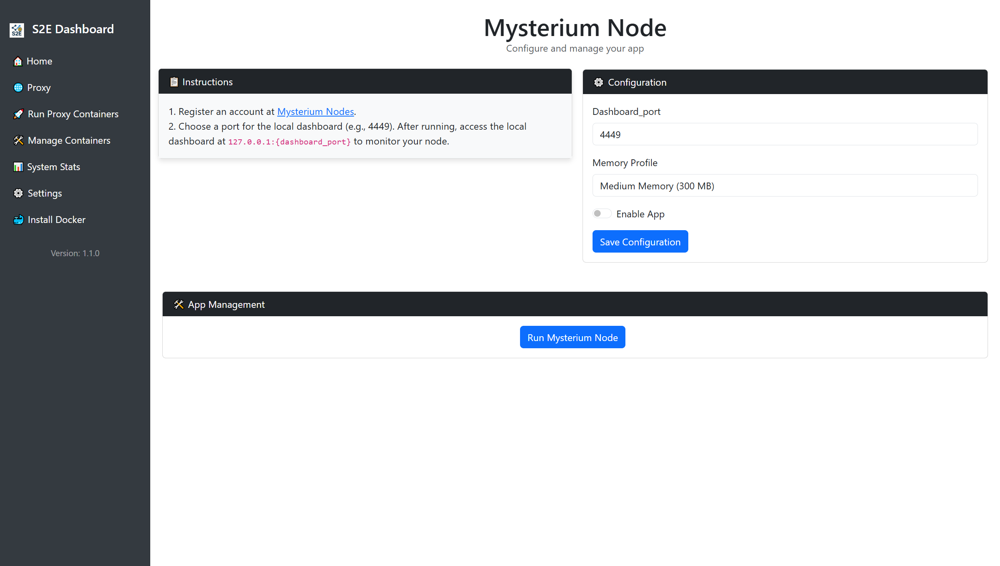
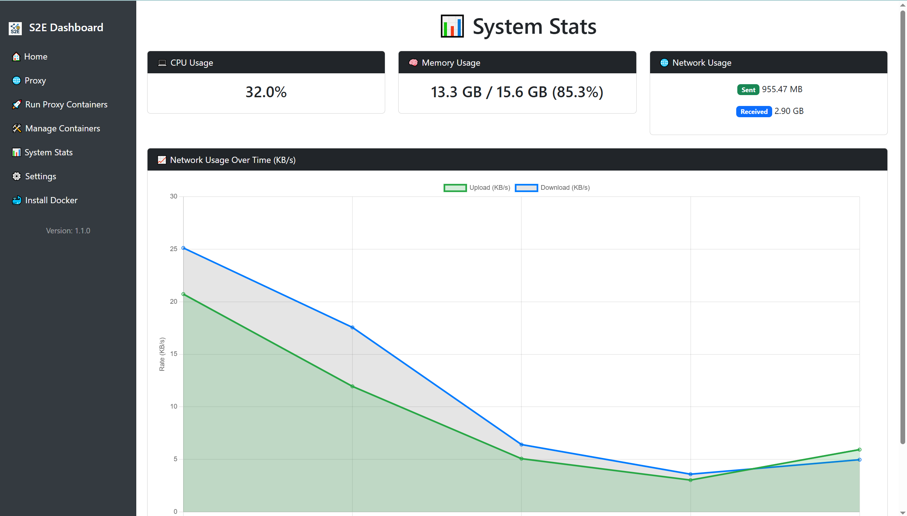
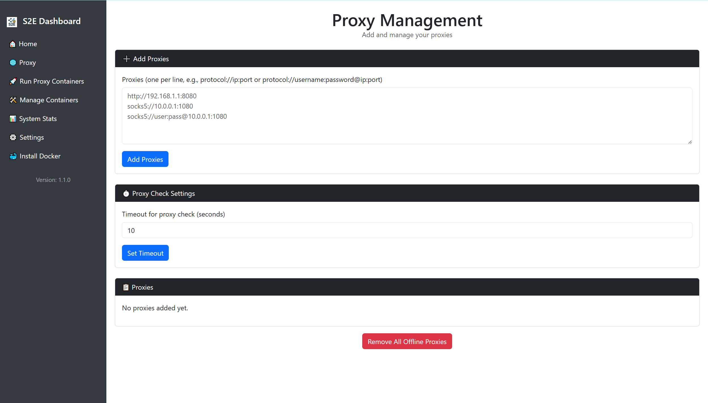

# Share2Earn (Multi-proxy support)

  **Share2Earn** - Earn passive income by sharing your spare Internet bandwidth with a user-friendly web dashboard. ⭐️ **Star** this repo if you enjoy it! |

## 📚 Table of Contents

- [🚀 Quick Start](#-quick-start)
- [⚙️ Configuration](#️-configuration)
- [🖥️ Usage](#️-usage)
- [🧩 Supported Apps](#-supported-apps)
  - [📘 Setup Made Simple](#-setup-made-simple)
- [📸 Screenshots](#-screenshots)
- [✅ Tested On](#-tested-on)
- [🤝 Contributing](#-contributing)
- [💖 Support the Project](#-support-this-project)
- [⚖️ License](#-license)


## 🚀 Quick Start

Get up and running in a few simple steps:

1. 🛠️ **Prerequisites**

   * [Docker Engine](https://docs.docker.com/get-docker/) & [Docker Compose](https://docs.docker.com/compose/)
   * **Python 3.7+**

2. 📥 **Clone & Enter the Repo**

   ```bash
   git clone https://github.com/vanhbakaa/share2earn.git
   cd share2earn
   ```

3. 📦 **Install Dependencies**

   ```bash
   pip install -r requirements.txt
   ```

4. ▶️ **Launch the Dashboard**

   ```bash
   python main.py
   ```

   * Open your browser at [http://localhost:5000](http://localhost:5000) ỏ your chosen port in `dashboard_config.json`.
   * First run auto-generates `data/` files and configurations.

---

## ⚙️ Configuration

All settings live under `data/` as JSON files:

| File                    | Purpose                                 |
| ----------------------- | --------------------------------------- |
| `dashboard_config.json` | Web UI port & admin credentials         |
| `app_config.json`       | Memory profiles & default apps          |
| `user_config.json`      | Your service accounts & global settings |

> 🔒 **Tip:** Update your admin username/password in `dashboard_config.json` before first use.

No extra environment variables needed. Ensure the `data/` folder is writable.

---

## 🖥️ Usage

1. 🔑 **Login:** Navigate to `http://localhost:5000` and sign in.
2. 🛠️ **Enable Apps:** Go to **Apps** / **Settings**, toggle services, and save your credentials.
3. 🚀 **Manage Containers:** In **Manage Containers**, Start/Stop each service—Docker images will download and run automatically.
4. 📊 **View Stats:** Check **Stats** for bandwidth usage and earnings.

> 💡 All actions are handled via the UI—no need for manual Docker commands.

---

## 🧩 Supported Apps

Share2Earn supports a variety of passive income and bandwidth-sharing platforms out of the box, including:

- 🧠 **EarnApp**
- 🐝 **Honeygain**
- 📦 **PacketStream**
- 🌐 **Mysterium**
- 💰 **Traffmonetizer**
- ⚡ **Peer2Profit**
- 🌟 **Ebesucher**
- 📊 **UpToLike**
- ➕ ...and more!

---

### 📘 Setup Made Simple

All app instructions and registration links are integrated directly into the dashboard UI.

> 🚀 **To set up any app:**
>
> 1. Launch Share2Earn and open the dashboard.
> 2. Navigate to the **Apps** section.
> 3. Click on any app to view:
>    - Setup steps
>    - Sign-up link
>    - Required credentials
>    - Helpful tips

There’s no need to search for guides — everything is built right into the dashboard for a smooth onboarding experience.


---

## 📸 Screenshots

Here’s a preview of the Share2Earn web interface in action:

|          🏠 Dashboard          |          ⚙️ App Configuration         |           📊 Stats          |        🌐 Proxy Management       |
| :----------------------------: | :-----------------------------------: | :-------------------------: | :------------------------------: |
|  |  |  |  |

## ✅ Tested On

| Platform              | Example Devices                   | Status    | Notes                           |
| --------------------- | --------------------------------- | --------- | ------------------------------- |
| 🖥️ Desktop/Laptop PC | Windows 10/11, Ubuntu 20.04+      | ✅ Working | Docker Desktop or native Docker |
| 🍓 Raspberry Pi       | Pi 4B / Pi 5 (64-bit OS)          | ✅ Working | Use lightweight containers      |
| 🍎 MacBook Pro        | macOS 12+ (Intel & Apple Silicon) | ✅ Working | Docker Desktop required         |

> 💡 Tested with Python 3.7 - 3.11 and Docker Engine 20.10+. If your system works and isn’t listed, feel free to contribute!

---

## 🤝 Contributing

Contributions are warmly welcome!

* 🐛 Report issues or request features via GitHub Issues.
* 🍴 Fork the repo, create a branch, and submit a PR.
* 📐 Keep code style consistent and update this README for any new features.

---

# 💖 Support This Project

If you find this project helpful and would like to support its continued development, please consider making a donation. Every contribution helps keep the project alive and growing!

### 💰 How to Donate:

You can donate via the following platforms:

1. **PayPal**  
   [Donate via PayPal](https://www.paypal.com/paypalme/vanhbaka)  

2. **Crypto**  
   - **Ton**: `UQABOtzug-KWStTEAYYJhaVL0SaLgHtoCWIQzZ4IqaSaA1ue`

Your donations help:
 
- Support further development and bug fixes.
- Add new features and improve existing ones.
- Keep the project free and open-source for everyone!

Thank you for your generosity and support! 🙏

---

## ⚖️ License

Distributed under the **MIT License**. See [LICENSE](LICENSE) for details.

> ⚠️ **Disclaimer:** Use at your own risk. Monitor your bandwidth and earnings when running multiple services.

---
